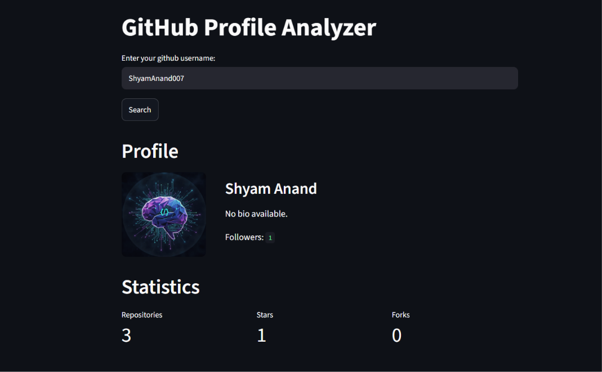
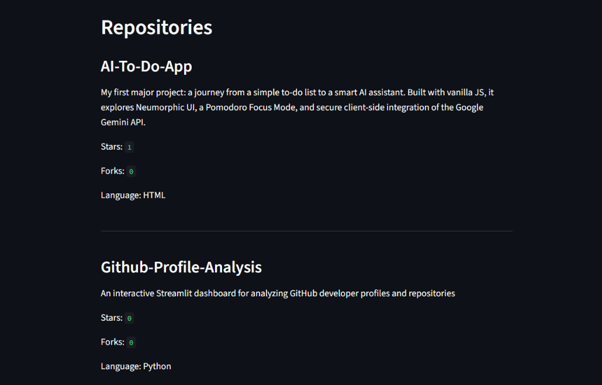
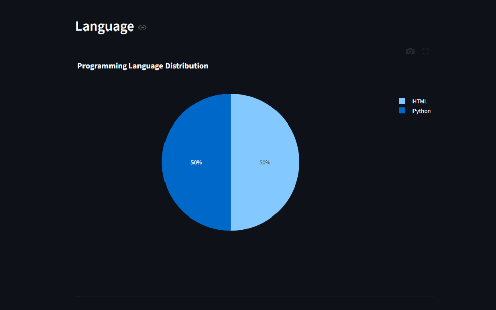

# GitHub Developer Analytics

An interactive data analytics dashboard built with **Streamlit** that analyzes GitHub developer profiles and repositories to generate meaningful insights through statistics and visualizations.

## What It Does

GitHub Developer Analytics allows users to enter a GitHub username and explore their public GitHub profile and repository data.

The application fetches data using the **GitHub REST API**, processes the data, and presents the results through an interactive dashboard.

## Features

* Analyze GitHub user profiles
* Repository statistics
* Total stars and forks analysis
* Programming language distribution
* Interactive charts and visualizations
* Repository performance analysis
* Developer activity insights
* Basic API error handling

## Tech Stack

* **Python** — Core programming language
* **Streamlit** — Interactive web dashboard
* **Pandas** — Data processing
* **Plotly** — Interactive visualizations
* **Requests** — API requests
* **GitHub REST API** — GitHub profile and repository data

## Project Structure

```text
github-developer-analytics/
├── api/
├── analysis/
├── visualization/
├── utils/
├── assets/
├── tests/
├── app.py
├── requirements.txt
└── README.md
```

## How to Access

The application is deployed using **Streamlit Cloud**, so it can be accessed directly through a web browser without installing the project locally.

**Live Application:**
[GitHub Developer Analytics](https://gith-profile-analysis.streamlit.app/)

Simply enter a valid GitHub username to view the analysis.

## Screenshots

### Dashboard



### Repository Analysis



### Visualizations



## Installation

To run the project locally:

```bash
git clone https://github.com/ShyamAnand007/Github-Profile-Analysis.git

cd Github-Profile-Analysis

python -m venv venv
```

### Activate the virtual environment

**Windows:**

```bash
venv\Scripts\activate
```

**Linux / macOS:**

```bash
source venv/bin/activate
```

### Install dependencies

```bash
pip install -r requirements.txt
```

### Run the application

```bash
streamlit run app.py
```

## Upcoming Improvements

The current version focuses on profile and repository analytics. Future updates may include:

* AI-generated developer insights
* Skill prediction
* Developer comparison
* Repository recommendations
* GitHub contribution analysis
* Commit activity analysis

## Project Status

**Completed and deployed using Streamlit Cloud.**
